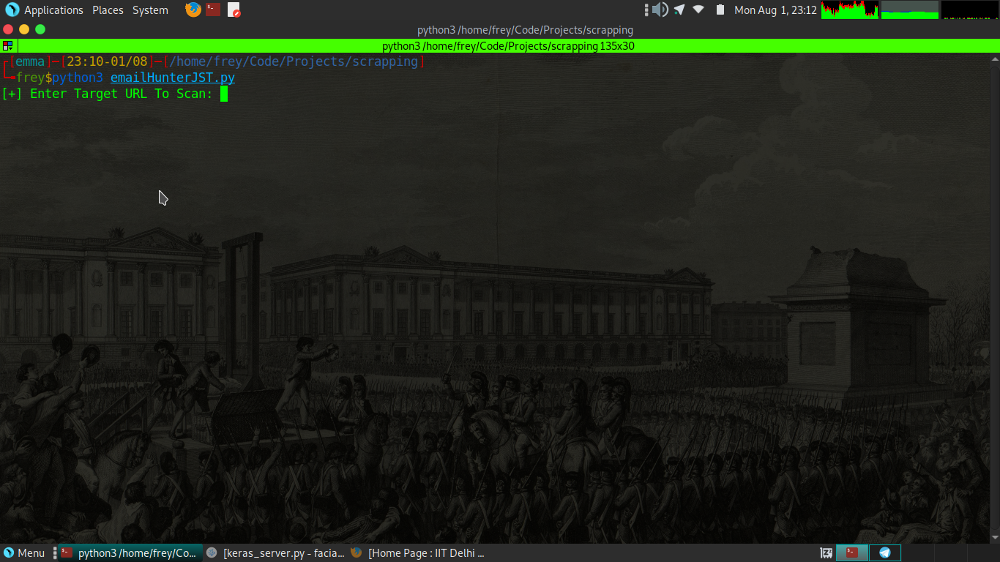
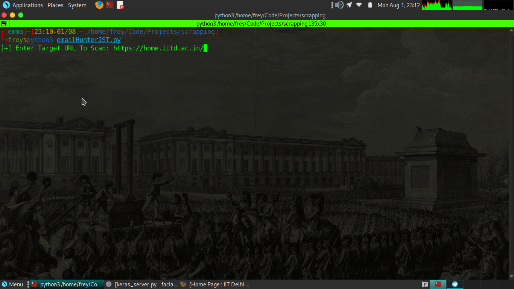
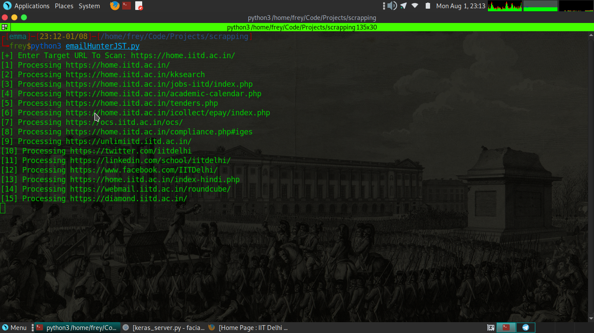
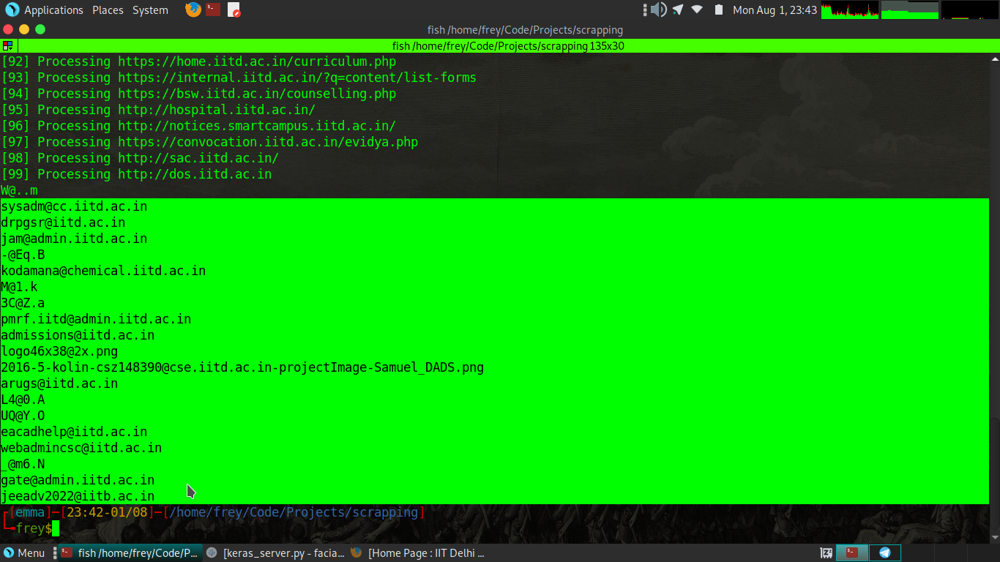

# Hello There, Thank You For Visiting This Awesome Tool ! 
## This is my first cyber security tool written in python
### :- I'm Frey aka FreyJST Bug hunter and CTF player i'm preapring for my OSCP exam and while doing this i started to write small tools so i can understand how these awesome tools really works 

## Inspiration :- theHarvester i am using this tool for so long but one day i thought why not make my own emailscrapper tool and i did it ! 

Follow Me :- 

Twitter :- [Twitter](https://www.twitter.com/frey0xd)
Instagram :- [Instagram](https://www.instagram.com/frey0xd)
Youtube :- [Youtube](https://www.youtube.com/c/freyjst)
My Website 1 :- [Website](https://frey0xd.tech)
Hacking Website :- [Website](https://frey0xd.tech)

#HOW TO USE

` Run this by python3 by typing python3 and the name of the script `

` Then it will ask you to enter the URL you wish to target `

` Then it will start finding emails from every pages of the website you target`

` And then here you go with results `

## Note:- I have used https://home.iitd.ac.in/ as my attacking site but i don't have permission to do that so please first take a permission because sometimes you can also be scrapping some of the prive pages with this tool xD otherwise Hack The Planet ! 

# @FREY0XD
